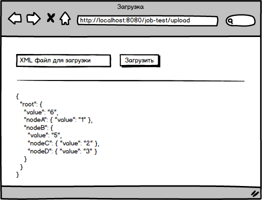

### Тестовое задание

Разработать web-приложение, позволяющее загружать данные в формате xml и выводить в заданном формате.

### Общие требования

1. Приложение должно быть реализовано на Java 8 или выше с использованием [Java Servlet API](https://docs.oracle.com/javaee/7/tutorial/servlets.htm). 
Допускается использование любого фреймворка/платформы/библиотеки работающего поверх Java Servlet API.
2. Приложение должно запускаться на сервере приложений [Tomcat](https://tomcat.apache.org/) 8 или выше.
3. Если в ходе обработки запроса в приложении произошла ошибка, то информация об ошибке должна быть сохранена в файл в стандартной папке журналов сервера 
приложений и на странице выводится сообщение "Произошла непредвиденная ошибка".
Для записи в файл сообщений от приложения использовать библиотеку [slf4j](http://www.slf4j.org/).
7. Для описания сборки приложения использовать любую из современных систем 
автоматической сборки: [gradle](https://gradle.org/), [maven](https://maven.apache.org/) и др.
8. Выполненное задание необходимо отправить ответным письмом по email.
9. Ориентировочный срок выполнения - 5 дней.

### Web-формы

Приложение должно содержать 2 формы:

1. форму, через которую можно загрузить файл на сервер,
2. форму, где можно увидеть результат загрузки.

Допускается обе формы разместить на одной странице.

Пример того, как может выглядеть страница:



### Параметры загружаемых файлов

1. Размер до 10Гб.
2. Формат xml.
3. Значения в xml строковые, но могут содержать числа как подстроку. Числа могут быть как дробные, так и целые.

### Формат вывода

Нужно вывести загруженный xml в виде дерева в формате html. Иерархию узлов исходного xml нужно полностью перенести в html, используя тэги ul и li.
Значения узлов в html должны формироваться по новому, следуя правилу:
значение узла должно быть равно сумме всех чисел которые встретились в этом узле и во всех его дочерних узлах.

### Пример
На входе:
```xml
<root>
 <node>Node 1</node>
 <node>
  <node>Node 2</node>
  <node>Node 3</node>
 </node>
</root>
```

На выходе:
```html
<ul>
 <li>
  6
  <ul>
   <li>1</li>
   <li>
    5
    <ul>
     <li>2</li>
     <li>3</li>
    </ul>
   </li>
  </ul>
 </li>
</ul>
```

### Критерии оценки
Оцениваться будет всё, начная от codestyle, заканчивая скоростью работы приложения. Как пример: плюсом будет наличие юнит-тестов.
Приветствуются свои оригинальные решения, не приветствуется копипаста с чужих готовых проектов.
